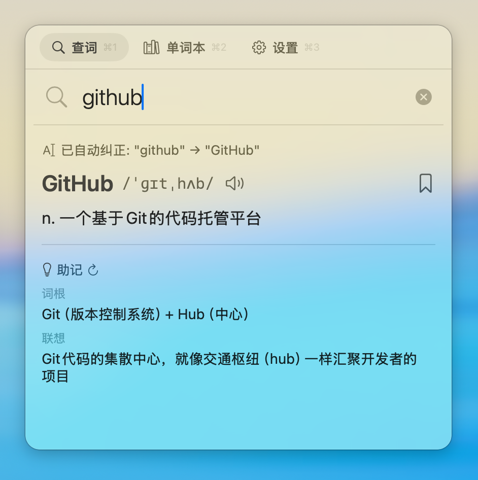

<div align="center">

# SnapDict

**macOS AI 划词翻译词典 | AI-Powered Dictionary for macOS**

快捷键划词翻译，AI 智能助记，单词本复习，语音朗读，墨水屏推送

[](https://github.com/zzpuser/SnapDict/releases/latest)
[](LICENSE)
[](https://github.com/zzpuser/SnapDict)
[](https://github.com/zzpuser/SnapDict)

</div>

| 翻译面板 | 单词本 | 设置 |
|:---:|:---:|:---:|
|  |  |  |

## 功能特性

- **划词翻译** — 全局快捷键唤起翻译面板，支持中英互译
- **AI 智能助记** — 基于 DeepSeek AI 生成词根词缀分析和联想记忆法
- **拼写纠正** — 自动检测拼写错误，支持自动纠正或手动选择
- **单词本** — 收藏生词，随时复习
- **TTS 语音朗读** — 集成豆包语音合成，支持自然语音朗读
- **墨水屏推送** — 定时推送单词卡片到墨水屏设备（支持文本和图片模式）
- **菜单栏常驻** — 轻量运行，不占用 Dock 栏

## 安装

1. 从 [Releases](https://github.com/zzpuser/SnapDict/releases/latest) 下载最新的 DMG 文件
2. 打开 DMG，将 SnapDict 拖入 Applications 文件夹
3. 终端执行 `sudo xattr -r -d com.apple.quarantine /Applications/SnapDict.app`
4. 打开 SnapDict

## 快速开始

1. 启动后在菜单栏找到 SnapDict 图标
2. 进入设置，填入 [DeepSeek API Key](https://platform.deepseek.com/)
3. 使用快捷键 `Cmd+Shift+E` 唤起翻译面板（可自定义）
4. 输入单词即可获取翻译、助记和例句

## 配置

| 服务 | 用途 | 必需 |
|------|------|:---:|
| [DeepSeek API](https://platform.deepseek.com/) | 翻译、助记、例句生成 | ✅ |
| 豆包 TTS | 语音合成 | ❌ |
| 墨水屏设备 (TRSS) | 单词推送 | ❌ |

## 从源码构建

> 要求：macOS 15.0+、Xcode 16.0+、Swift 6.0

```bash
# 安装 XcodeGen
brew install xcodegen

# 克隆并构建
git clone https://github.com/zzpuser/SnapDict.git
cd SnapDict
xcodegen generate
open SnapDict.xcodeproj
```

## 技术栈

- **语言**: Swift 6.0 (Strict Concurrency)
- **框架**: SwiftUI + AppKit
- **存储**: SwiftData
- **AI**: DeepSeek API
- **TTS**: 豆包语音合成
- **依赖**: [HotKey](https://github.com/soffes/HotKey)

## License

[MIT](LICENSE)
